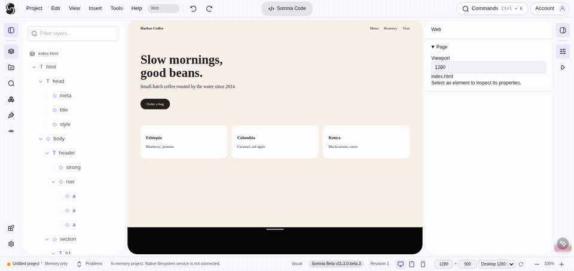
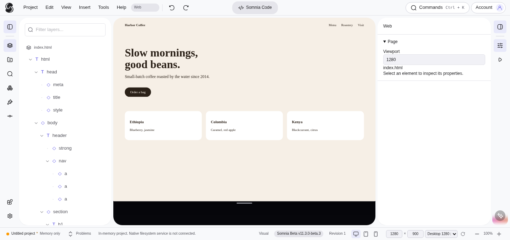
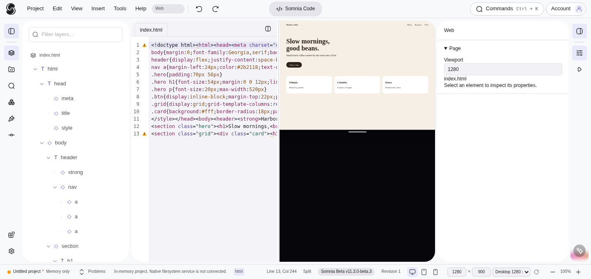
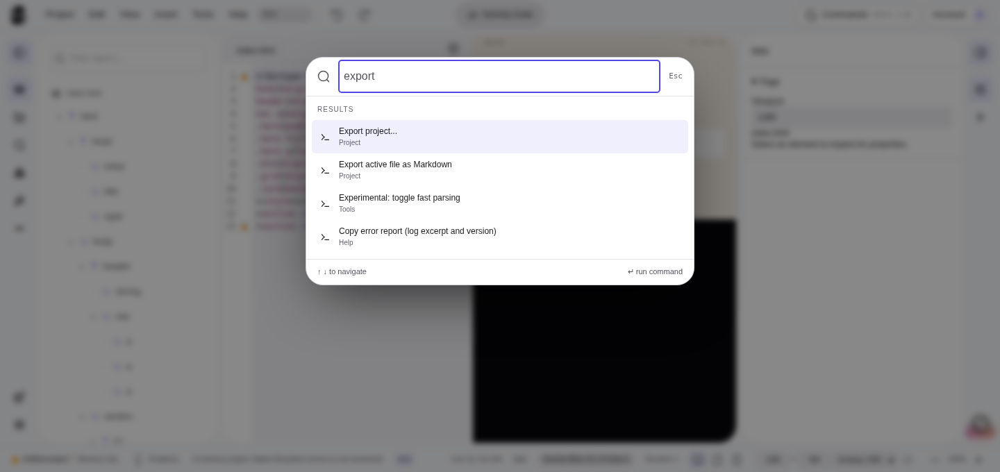
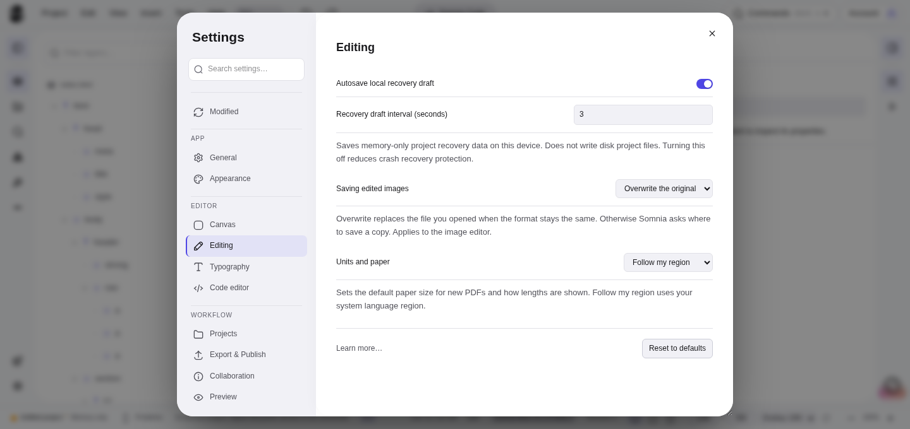

<p align="center"><picture><source media="(prefers-color-scheme: dark)" srcset="[docs/assets/brand/somnia-app-icon.png]"><source media="(prefers-color-scheme: light)" srcset="docs/assets/readme/logo-mark-black.svg"></picture></p>

# Somnia

Local-first visual web editor and Dreamweaver successor. Design canvas and code editor on the same source, plus inline editors for images, SVG and PDF. Your files stay on your machine: no account needed, no telemetry. MIT licensed.



**Status: beta.** Current pre-release: [v11.3.0-beta.5](https://github.com/philppplik/somnia/releases/tag/v11.3.0-beta.5). It has been checked in a browser against mocked desktop commands and in CI builds, but not on real Windows or macOS desktops yet. Installers are unsigned (SmartScreen warning on Windows, macOS is ad-hoc signed and not notarized).

## What it does today

- **Design and code on one source.** Edits in either place change the real HTML and CSS, with shared undo. Nothing is regenerated.
- **Layers, breadcrumbs, inspector, Problems panel** and a command palette (`Ctrl+K`).
- **Code editor** with Emmet, auto-close tags, linting, find and replace, Prettier formatting (loaded on demand) and a diff viewer.
- **Image editor:** inline raster editing with history, layered PhotoCraft documents (WASM), read-only previews for more formats such as TIFF and PSD, batch conversion.
- **SVG editor:** move, resize, draw, layers and node editing, path booleans, gradients, bitmap trace, snapping, guides, grid, clip and mask.
- **PDF editor:** work on copies; comments (list, edit, delete), AcroForm field designer (create, place, move, resize, rename, delete). XFA forms stay view-only.
- **Office preview:** read-only DOCX and XLSX in the file preview.
- **Settings:** search, a "Modified" view with reset, and per-project overrides in `.somnia/settings.json` (units, image saving, export options).
- **AI agent (optional):** a native panel that asks before reading or writing each file and shows every change as a preview. OpenRouter and local Ollama models; the GitHub login asks for the `repo` scope to read private repositories and uses it read-only.
- **Export:** ZIP, folder, single HTML file or Markdown. Themes and an extension SDK (see `docs/extensions/`).

| Design view | Split view |
| --- | --- |
|  |  |
| **Command palette** | **Settings** |
|  |  |

Screenshots are from the web build with mocked desktop commands.

Architecture: [docs/ARCHITECTURE.md](docs/ARCHITECTURE.md). Build and release: [docs/BUILD-AND-RELEASE.md](docs/BUILD-AND-RELEASE.md). Roadmap: [docs/ROADMAP.md](docs/ROADMAP.md). Benchmarks: [phase1/notes/BENCHMARKS.md](phase1/notes/BENCHMARKS.md).

## AI agent

Cloud processing requires opt-in. AI changes reach the editor only after review and are never saved automatically. Architecture, providers and privacy: [Agent documentation](docs/agent/README.md). Automated tests cover fake providers only so far.

## Download

Get installers from [Releases](https://github.com/philppplik/somnia/releases) (each release lists SHA-256 checksums).

## Repository layout

- `phase1/` - the app (Tauri + web frontend), tests and design notes (`phase1/notes/`)
- `relay/` - `somnia-relay`, the blind WebSocket relay for collaboration
- `docs/` - documentation, see [docs/README.md](docs/README.md); `docs/ARCHITECTURE.md` is the technical overview, `docs/extensions/` the extension SDK guide. The project site (`index.html`) also lives here.
- `proto/` - early prototypes (Phase 0, frozen)

## Develop

```
cd phase1
npm ci
npm run craft:build  # WASM bridges, needs Rust 1.95, the wasm32 target and wasm-bindgen
npm run dev        # web dev server
npm run test:core  # unit tests
npm run bench      # editor-core benchmarks
npx playwright test
```

## Contributing

Work in feature branches and open a pull request. CI must be green.

## License

MIT, Copyright Philipp Paulik. See `LICENSE`.
